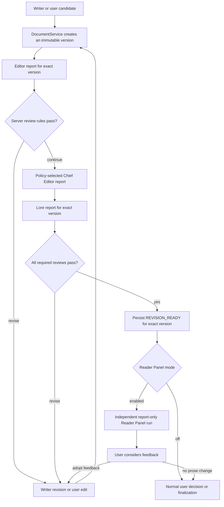

# GuraNovel architecture

This document describes the public architecture contract for GuraNovel. It separates what is
available in the v0.8 release from the chapter-quality pipeline planned for v0.9 and the optional
Reader Panel planned for v0.10. A name in a target-state diagram is not evidence that the
corresponding production code already exists.

## Capability legend

| Label | Meaning |
| --- | --- |
| **Implemented (v0.8)** | Present in the released application and backed by production code. |
| **Target contract (v0.9)** | Required architecture for the next chapter-production implementation; not implemented by this document. |
| **Future extension (v0.10)** | Reader Panel behavior that must preserve the v0.9 boundary; not implemented by this document. |

This document is an architecture contract only. It does not add workflow states, database schema,
routes, UI, or model calls.

## Implemented baseline (v0.8)

The following is the current implementation, not the larger historical workflow design:

- `Document` has an immutable sequence of `DocumentVersion` rows and a pointer to its current
  version. `DocumentService` is the application boundary for creating, writing, and restoring
  documents. It locks writes and checks `expected_current_version_id` so a newer version cannot be
  overwritten silently.
- A chapter-production run calls one configured generation provider, validates its response, and
  stores an outline and a draft through `DocumentService`.
- The run then creates one user action with `approved` and `rejected` options. Approval completes
  the run and changes the chapter status to `OUTLINE_APPROVED`; rejection ends the run as rejected.
- Chapter-production events expose a small allowlisted payload. Generated prose and prompts are not
  returned in event payloads.
- `WorkflowRun`, `WorkflowEvent`, `WorkflowCheckpoint`, `ActionRequest`, `ReviewReport`, and
  `DocumentVersion` provide reusable persistence primitives. The current chapter-production flow
  does not create checkpoints or chapter review reports.
- Existing project-creation and project-maintenance workflows use their own states, services,
  actions, reviewers, and persistence rules. Their Lore and Chief Editor capabilities are not
  connected to chapter production merely because similarly named agent contracts exist.
- `ProjectCreationGraph` and `ProjectMaintenanceGraph` are product-architecture names in this
  document. The v0.8 implementations are service-backed state machines; the repository does not
  currently run those workflows through a LangGraph runtime.
- Some chapter review names already appear in shared enums. Those names are schema affordances,
  not implemented chapter workflow nodes.

In particular, v0.8 does **not** implement Writer revision loops, chapter Editor/Lore/Chief Editor
review, `REVISION_READY`, Reader or Moderator agents, or a Reader Panel.

## Authority principles

The target pipeline is human-led and version-bound:

1. Model output is untrusted data. Providers return candidates or reports; they never return
   authoritative workflow commands.
2. Every review and audience report targets one immutable document version, never “the latest
   chapter” by implication.
3. Only application services persist state. Agent and provider objects have no database, workspace,
   action-resolution, or workflow-transition capability.
4. A user decision can accept a proposal, but canonical prose changes still pass through
   `DocumentService` and create a new `DocumentVersion`.
5. Reader feedback is advisory. It cannot replace required Editor, Lore, or Chief Editor review.
6. Persist identifiers, hashes, decisions, and bounded structured results. Do not put chapter text,
   full prompts, credentials, provider responses, or complete reports in workflow events or
   checkpoints.

## LangGraph scheduling boundary (target contract, v0.9)

PostgreSQL is the sole business source of truth for Chapter Production V2. `WorkflowRun`,
`WorkflowCheckpoint`, `ActionRequest`, `ReviewReport`, `Document`, and `DocumentVersion` retain their
existing authority, and `DocumentService` remains the exclusive canonical document writer.
LangGraph is only the node/edge scheduler: it selects the next typed node from a bounded mechanical
cursor and returns a typed routing outcome. It does not authorize a transition, resolve an action,
approve a report, select a current document version, or make an artifact durable.

Every graph invocation uses `thread_id = workflow_run_id`. The server chooses the graph definition
through a server-owned `graph_id` and `graph_version`; clients, providers, persisted model output,
and arbitrary graph state cannot select or upgrade either value. An unknown graph identity, version,
node, edge, state key, or outcome fails closed before a domain mutation or provider call. A deployed
graph version is immutable. Compatibility code may reconstruct a run with an explicitly supported
older graph version, but it must never reinterpret that run as the current version.

LangGraph execution state is an optimization, not a durable domain record. A LangGraph cursor or
checkpoint may be corrupted, unavailable, or discarded in full. The scheduler must then be
reconstructed from PostgreSQL by locking and validating the exact run, current workflow checkpoint,
pending action, version-bound reports, canonical document, and current document version. The
reconstruction reads the six authoritative model families above and derives the next legal node;
it does not copy their payloads into graph state. A LangGraph checkpoint must never become a second business truth,
and no recovery path may choose it over conflicting PostgreSQL state.

Reconstruction applies each domain contract's exact 0, 1, or N cardinality rules under fresh locks.
It accepts one row or one bound row set only when that contract permits it. Zero is either a valid
not-yet-created state or corruption according to the current transition; N greater than one is never
silently reduced to a winner. An orphan, mismatch, duplicate, malformed, or cross-scoped record is
not routing guidance. The scheduler must not guess, fill a gap, select the newest row, or use a graph
cursor to repair PostgreSQL; it returns reconciliation-required before mutation or provider setup.

The existing PostgreSQL `WorkflowCheckpoint` is not a generic LangGraph checkpoint. It remains a
bounded, domain-owned record of a committed workflow transition. A LangGraph checkpointer, if one is
configured, stores only the disposable allowlist below. It may point at a committed PostgreSQL
checkpoint but cannot create one, fill a missing domain transition, or prove that an action, report,
version, readiness marker, or final document exists. Deleting the generic graph checkpoint must not
lose a user decision, provider claim, review, version, event, or finalization fact.

### PostgreSQL-authoritative runtime pin

Every new Chapter Production V2 run pins its scheduler contract under
`WorkflowRun.metadata.chapter_production_runtime`. The server-owned namespace has exactly these three keys:

| Field | Contract |
| --- | --- |
| `scheduler_kind` | Closed enum: `service_v2` or `langgraph`. |
| `graph_id` | Server-owned definition ID; `service_v2_legacy` for the service scheduler. |
| `graph_version` | Server-owned immutable version; `legacy` for the service scheduler. |

The server validates the exact shape and writes the pinned tuple in the same transaction that creates the run,
its initial domain checkpoint, and other required initial state. Extra, missing, client-selected, or
malformed namespace keys fail closed. A live run may be invoked only by the exact pinned tuple; any change to the pinned tuple,
including a partial edit or a supported-but-different version, is reconciliation-required rather
than an upgrade or fallback.

Historical V2 runs with a missing namespace are bound to the service_v2 legacy contract, interpreted
as `(service_v2, service_v2_legacy, legacy)` without rewriting the row. They must never be auto-upgraded,
backfilled during ordinary execution, or routed through LangGraph. A graph checkpoint may copy the
validated tuple as disposable routing data, but a graph checkpoint cannot create, own, or modify the runtime pin.
PostgreSQL reconstruction always reloads the namespace and compares it with server composition.
The strict-shape parser, legacy interpretation, and transactional pin creation belong to a dedicated
P0 schema-and-compatibility Issue that must be completed before #149 begins. #149 consumes that
boundary and only composes the graph; it does not introduce or reinterpret runtime identity.

### Exact content-free graph state allowlist

The graph state schema is closed. Its complete top-level allowlist is:

| Field | Type and meaning |
| --- | --- |
| `workflow_run_id` | UUID reference used as the LangGraph thread ID and PostgreSQL reconstruction key. |
| `graph_id` | Bounded server-owned graph-definition enum. |
| `graph_version` | Bounded server-owned immutable graph-contract version. |
| `cursor` | Bounded server-owned scheduling cursor enum; it is re-derived from PostgreSQL. |
| `workflow_checkpoint_index` | A non-negative integer copied from the freshly locked latest domain checkpoint. It is only a freshly derived stale hint and reference and has no authority. |
| `invocation_id` | Server-created UUID for one scheduling invocation and log correlation. |
| `attempt_id` | Optional fresh UUID reference to a persisted draft or revision provider claim. |
| `claim_id` | Optional fresh UUID reference to a persisted reviewer claim. |
| `action_request_id` | Optional UUID reference to the exact persisted human gate at which execution pauses. |
| `resume_reason` | Bounded server enum: new, action-resolved, retry, or reconcile. |

No additional key is permitted. In particular, graph state contains no prose, prompt fragments,
report content, provider result, client metadata, path, endpoint, credential, or arbitrary mapping.
IDs and enums are references, not authority: every node reloads and scope-checks the referenced rows
instead of trusting a graph-state relationship, cursor, or status.

Persistent graph state may point only through `workflow_checkpoint_index` to the domain checkpoint
from which it was freshly derived. It cannot store an opaque checkpoint row, payload, event, or
alternate pointer. On invocation, a mismatch with the locked latest checkpoint makes the graph state
stale; the scheduler reconstructs rather than following the hint.

The checkpointer payload, framework configuration, and framework metadata are each closed and sanitized
before entering LangGraph or any persistence adapter. The checkpointer payload is exactly the graph
state allowlist above. Invocation configuration permits only the server-built
`configurable.thread_id` and a bounded server-owned recursion limit. Framework metadata is limited to
the safe state subset `workflow_run_id`, `graph_id`, `graph_version`, `cursor`,
`workflow_checkpoint_index`, and `invocation_id`. Unknown keys, nested configurable dictionaries,
callbacks supplied as data, tags, arbitrary metadata, and any hidden extension or provider/client
value fail closed before persistence, logging, node construction, or provider setup.

### Closed typed outcome boundary

A node returns a closed discriminated mechanical schema, not persistent graph state and not an observability envelope.
The required discriminator is a server enum with exactly `continue`, `await-user`,
`retryable-failure`, `reconciliation-required`, `cancelled`, or `complete`. Each variant permits only
its declared mechanical fields: a bounded next cursor, exact action or claim reference when needed,
and a fixed failure or completion code. It contains no prose, report, provider result, database row,
path, exception context, or unrestricted metadata. Unknown discriminator values and extra fields fail
closed. The observability allowlist does not define or widen either persistent graph state or a typed
outcome; telemetry projects a safe subset from already validated values.

### Persisted human gates and pause/resume

A persisted `ActionRequest` is the pause capability. The graph returns an `await-user` outcome only
after the chapter orchestrator has atomically persisted the exact `ActionRequest`, `WorkflowRun.awaiting_user`, and `WorkflowCheckpoint`.
A matching `WorkflowEvent` is persisted only when that domain transition contract defines one; it
is not manufactured merely because LangGraph pauses. A `WorkflowEvent` is audit evidence, never gate authority.
The disposable graph state may retain the exact action ID only as a scheduling reference; an
in-memory interrupt payload is never a decision capability.

Resume begins with the authenticated application service resolving that exact action ID in a fresh transaction.
It locks and revalidates owner, project, chapter, workflow run, action kind and options,
pending status, current workflow checkpoint, expected document version, and single-use decision.
In the same locked transaction, after acquiring every required lock, it performs one query for a
single PostgreSQL `clock_timestamp()` wall-clock value named `database_now`. Expiry validation must not use `CURRENT_TIMESTAMP`,
`transaction_timestamp()`, `statement_timestamp()`, or an application or client clock: those values
can predate time spent waiting for a lock and incorrectly authorize an action that expired meanwhile.
`expires_at IS NULL` means no expiry; otherwise resolution requires `database_now < expires_at`.
When `database_now >= expires_at`, the action is stale and cannot be resolved. Existing V2-created
actions use the null, non-expiring form, while the general contract remains safe for a future bounded
expiry. Expired, stale, foreign, mismatched, and already-resolved capabilities return a fixed stale/foreign action error
that does not disclose whether an action ID exists, its prompt or options, another owner, its scope,
timestamps, or the current workflow state.
Only the committed PostgreSQL resolution makes a resume eligible. The graph is then reconstructed
from the run and routes from the server-owned result. A resume never trusts client-supplied graph state,
a client cursor, an action option copied from a prior response, or an interrupt resume value to resolve an action
or select the next node. A stale, foreign, cancelled, already-resolved, or mismatched action fails
closed without changing the graph or domain state.

### Provider-node three-phase transaction

Every Writer, Revision, Editor, Chief Editor, and Lore operation uses the same three phases. The
phase boundary belongs to an application coordinator; the LangGraph node is only its typed adapter.

1. **Phase 1 - claim and snapshot.** Open a short transaction, acquire the prescribed advisory and
   row locks, reload all scoped authoritative rows, validate the current transition, and persist a
   unique provider claim containing the operation key, a fresh UUID `attempt_id` or `claim_id` as its generation token,
   immutable input version IDs and hashes, and the expected checkpoint. The service must commit the claim before returning
   from this phase. A lost or indeterminate commit acknowledgement enters explicit
   reconciliation and performs zero provider calls.
2. **Phase 2 - provider call.** Close the Phase 1 session and transaction. Build the provider request
   from the validated immutable snapshot, then call the server-selected agent/provider while no database session or transaction is open.
   The request and result may contain prose in process,
   but they never enter graph state, graph checkpoints, generic node outcomes, or logs.
3. **Phase 3 - fresh lock, revalidate, and persist.** Open a new session and transaction, reacquire
   locks in the canonical order, and reload with fresh database values. Revalidate ownership and
   project/chapter/run scope, the fresh claim token, operation key, checkpoint, and current domain binding,
   including node, action/report bindings, review policy, locator map when applicable, and the current version and content hash.
   Strictly validate the provider output, then let the appropriate
   coordinator and `DocumentService` persist the one canonical result, transition, checkpoint, and
   allowlisted event. A stale or invalid result cannot mutate state.

Cancellation and known provider failures release or fail only the still-current claim under fresh
locks. A commit-indeterminate result is never guessed from the graph cursor or retried blindly; it
routes to the persisted reconciliation contract. No graph node owns or reuses an `AsyncSession`, and
no session or transaction crosses a provider call.

### Typed node contracts

Node inputs are freshly reconstructed typed references, while node outputs use the separate closed
outcome schema above. Neither is inferred from free-form graph metadata. Candidate prose and full
reports remain private, ephemeral coordinator data. The following table is the complete proposed
Chapter Production V2 topology; adding a node or edge is an architecture-contract change.

| Node | Typed input | Typed output | Authority | Side effects | Failure semantics |
| --- | --- | --- | --- | --- | --- |
| `reconstruct` | `ReconstructInput` with run and graph identity | `RouteOutcome` with a derived cursor | Read authoritative rows only | None | Corruption, unsupported graph version, or ambiguous state becomes reconciliation-required. |
| `draft` | `ProviderNodeInput` bound to a drafting run | `DraftOutcome` | `ChapterDraftRevisionCoordinator` validates; the node has none | Three-phase Writer claim and canonical candidate persistence through `DocumentService` | Typed provider failure is retryable; stale claim is ignored; unknown persistence result requires reconciliation. |
| `await_author_action` | `ActionGateInput` with exact run and optional action reference | `AwaitActionOutcome` | `ChapterDraftRevisionCoordinator` creates or reloads the gate | Persist or reuse one scoped `ActionRequest` and checkpoint, plus a matching event only when its domain transition requires one | Duplicate, stale, foreign, or corrupt gates fail closed; event has no gate authority and a live gate returns await-user. |
| `author_revision` | `AuthorRevisionInput` referring to a committed decision | `RevisionOutcome` | `ChapterDraftRevisionCoordinator` and `DocumentService`; the node has none | Manual edit or three-phase feedback revision creates one immutable version | Invalid decision or stale base fails closed; provider and commit uncertainty use their typed outcomes. |
| `editor_review` | `ReviewNodeInput` for the exact current version and Editor role | `ReviewOutcome` | `ChapterReviewCoordinator` applies server review policy | Three-phase Editor claim and one validated `ReviewReport` or warning action | Invalid or stale reports cannot advance; provider failure is normalized; unknown commit requires reconciliation. |
| `chief_editor_review` | `ReviewNodeInput` for the policy-required Chief Editor role | `ReviewOutcome` | `ChapterReviewCoordinator` applies server-selected policy | Three-phase claim and one exact-version `ReviewReport` when required; otherwise no provider side effect | Policy drift or unexpected invocation fails closed; provider and commit failures are typed. |
| `lore_review` | `ReviewNodeInput` for the exact current version and Lore role | `ReviewOutcome` | `ChapterReviewCoordinator` applies server review policy | Three-phase Lore claim and one validated exact-version `ReviewReport` or warning action | Invalid, stale, or cross-scoped reports cannot advance; failures are normalized. |
| `corrective_revision` | `CorrectiveRevisionInput` bound to validated review reports | `RevisionOutcome` | `ChapterDraftRevisionCoordinator`; `DocumentService` writes | Three-phase Revision claim and one immutable child version | Changed reports, version, policy, locator map, or fresh claim token reject the result. |
| `mark_revision_ready` | `ReadinessInput` with exact reviewed-version references | `ReadinessOutcome` | `RevisionReadinessStore` owns validation and persistence | Atomically create or reuse the exact READY checkpoint and bound event | Any cardinality, binding, current-version, hash, or report mismatch requires reconciliation. |
| `finalize` | `FinalizationInput` bound to current READY state | `FinalizationOutcome` | `ChapterFinalizationSaga` and `DocumentService`; the node has none | Idempotently materialize the final document and complete the run | Prewrite failure is retryable when proven safe; postwrite or commit uncertainty requires reconciliation. |
| `reconcile` | `ReconciliationInput` with run and bounded failure code | `RouteOutcome` | `ChapterProductionRecovery` evaluates persisted evidence | May adopt a proven committed result or persist a bounded recovery transition | Ambiguous or conflicting evidence remains reconciliation-required; it never fabricates success. |

This contract intentionally keeps eleven scheduler nodes. Candidate persistence is an atomic or
three-phase internal sub-stage of `draft`, `author_revision`, or `corrective_revision`; review evaluation
is an internal sub-stage of the relevant Editor, Chief Editor, or Lore coordinator call; final evaluation
is an internal sub-stage of `lore_review` before `mark_revision_ready` independently revalidates and
persists readiness. These are internal coordinator sub-stages, not separate scheduler nodes, so
candidate text and report bodies never cross a graph edge or enter graph state. The #149 body must be updated before development begins
to match this topology instead of adding candidate-persistence, review-evaluation, or
final-evaluation nodes.

Each node opens only the sessions needed by its coordinator call and returns a typed output after
those sessions close. Nodes cannot write ORM rows, call filesystem APIs, resolve actions, choose
providers, or invoke `DocumentService` directly. Conditional edges inspect only the typed output;
they never parse free-form provider text or database metadata.

### Service convergence map

At the #147 baseline, the oversized `ChapterProductionV2Service` monolith combines scheduling,
locking, provider attempts, review, readiness, finalization, and recovery. Its tested public contract
remains stable while implementation issues extract domain responsibilities behind it:

| Disposition | Component | Boundary after convergence |
| --- | --- | --- |
| **Retain** | `ChapterProductionV2Service` | Thin stable facade with the existing public methods, DTOs, fixed exceptions, authorization entry points, and composition. It exposes one orchestration boundary to future routes. |
| **Retain** | `DocumentService` | Exclusive immutable document/version writer and expected-current-version enforcement. |
| **Split** | `ChapterProductionRepository` | Short-lived session operations, canonical advisory/row lock order, forced refresh, exact-cardinality queries, and scope-bound reconstruction. It never calls a provider. |
| **Split** | `ChapterDraftRevisionCoordinator` | Initial draft, author accept/manual edit/feedback revision, corrective revision, locator validation, and candidate persistence orchestration. |
| **Split** | `ChapterReviewCoordinator` | Reviewer selection, claims, strict report validation, warning/blocking action bindings, deterministic review policy, and report persistence. |
| **Split** | `RevisionReadinessStore` | Exact READY semantic key, checkpoint/event cardinality, version/report/hash revalidation, create-or-reuse, and consumption. |
| **Split** | `ChapterFinalizationSaga` | Final-document staging, workspace materialization, commit acknowledgement, idempotent replay, and completion. |
| **Split** | `ChapterProductionRecovery` | PostgreSQL reconstruction, stale-state handling, failed-attempt recovery, committed-result adoption, and explicit reconciliation. |
| **Split** | `ProviderAttemptCoordinator` | Claim identity, immutable snapshot references, fresh-token checks, release/failure, transaction-free provider handoff, and result revalidation. |
| **Wrap** | LangGraph node adapters | Call the stable facade or extracted coordinators with typed references; contain no ORM, document, provider-selection, or security rule. |
| **Remove** | Duplicated private scheduling branches | Removed only after #150 proves parity and rollback. Domain validation, locks, recovery, security checks, and fixed-error behavior are moved, not deleted. |

Extraction must be behavior-preserving. The facade may first delegate to extracted modules while the
handwritten scheduler remains active; LangGraph adoption does not justify parallel implementations
of a lock, validation rule, persistence write, or recovery decision.

A separate P0 CI hardening Issue must be completed before #149 begins. It enforces dependency
direction with import-boundary tests: node and topology packages cannot import ORM models,
SQLAlchemy, filesystem adapters, concrete providers, or private repository implementations, while
the facade cannot import ORM models or lock helpers. After extraction the facade must not reacquire ORM queries or lock orchestration;
new persistence and concurrency behavior belongs behind the repository/coordinator ports. CI also
fails if extracted modules import back through the facade and create a dependency cycle.

### Recovery and failure matrix

Every entry is decided from freshly loaded PostgreSQL evidence, not from a graph checkpoint:

| Scenario | Required detection and durable behavior | Scheduler outcome |
| --- | --- | --- |
| Restart | Reconstruct the exact run, checkpoint, live action, current document/version, reports, and persisted attempt; discard any graph cursor. | Route to the one legal next node, await the exact action, or require reconciliation. |
| Stale invocation | Invocation references an old checkpoint, action, version, policy, claim, or graph version after fresh locking. | Perform no write and no provider call; return stale or reconciliation-required as appropriate. |
| Claim-token ABA | Invocation A's fresh attempt or claim UUID, operation key, checkpoint, or current binding no longer matches after claim B was created. | Late success, failure, or cancellation from A is ignored and cannot release or overwrite B. |
| Cancellation | Catch cancellation outside the transaction-free provider call, then fresh-lock and release only the exact current claim when safe. | Return cancelled; committed business state remains authoritative and resumable. |
| Provider failure | Normalize timeout, rate limit, invalid output, and unavailable failures without raw exception context; fresh-lock the current claim. | Persist only the bounded allowed failure transition and return a typed retryable or terminal outcome. |
| Commit-indeterminate | A claim, version, report, readiness, or finalization commit lacks acknowledgement, so success and failure are both possible. | Make no blind retry or second provider call; route to evidence-based reconciliation. |
| Reconciliation | Lock and inspect exact semantic keys, versions, hashes, actions, reports, checkpoints, events, filesystem evidence, and attempt identity. | Adopt only a uniquely proven committed result; conflicts remain failed closed for operator action. |

### PostgreSQL reconstruction evidence matrix

Before using a status row, reconstruction proves that the latest domain checkpoint is exactly one contiguous maximum:
there is one row at the maximum `checkpoint_index`, its run/node/state projection equals
`WorkflowRun`, and the immediately previous row, when present, is exactly maximum minus one. It does
not require old history to be gap-free beyond that frozen #110 rule. For all states, pending action cardinality is exactly 0 or 1
as dictated by `awaiting_user`; a candidate-bound state requires that the current draft and version resolve to exactly one bound pair
with matching project, chapter, document, version, hash, and current pointer; stage reports use the required exact 0/1 combination
for the active policy and target version. A provider attempt or reviewer claim is 0 or 1 and current,
with its fresh token, operation key, checkpoint, status, target, and hash all matching.

| State | Candidate and action evidence | Report and claim evidence | Additional durable evidence | Derived route |
| --- | --- | --- | --- | --- |
| `DRAFTING` | Initial drafting has no candidate and no pending action; feedback drafting has exactly one bound source candidate and no pending action. | No review report; provider attempt is zero before claim or one exact current Writer/Revision claim. | Approved outline/version/hash and operation key match the run; a uniquely committed child may be adopted only by reconciliation. | Claim/resume Writer or Revision, adopt one proven child, or reconcile. |
| `AUTHOR_REVISION` | Exactly one current draft/version; one pending author action while waiting, or zero pending plus one exact resolved source action only during manual-edit commit reconciliation. | No review reports and no reviewer claim or provider attempt. | Action kind, options, version/hash binding, owner, and decision state match the checkpoint. | Await the action, enter Editor review after acceptance/edit, or reconcile a uniquely committed manual child. |
| `EDITOR_REVIEW` | Exactly one current draft/version; pending action is zero except one exact warning action bound to an already persisted Editor report. | Editor report is zero before evaluation or exactly one for a warning; Chief and Lore reports are zero; reviewer claim is zero or one exact current Editor claim. | Review policy, role, mode, target hash, report/action provenance, and current checkpoint match. | Execute/evaluate Editor, await warning, advance by policy, or reconcile. |
| `REVIEW_REVISION` | Exactly one current draft/version; pending action is one before the blocking decision and zero after its exact resolution. | At least the triggering stage report is exactly one; only policy-ordered earlier report slots may also be one; provider attempt is zero or one exact current Revision claim. | Report tuple/input hash, resolved action when required, locator snapshot, source version, and operation key match. | Await revision authorization, execute corrective revision, adopt one proven child, or reconcile. |
| `CHIEF_FINAL_REVIEW` | Exactly one current draft/version; pending action is zero except one exact Chief warning action bound to the Chief report. | Editor report is exactly one, Chief report is zero before evaluation or one for a warning, Lore report is zero; reviewer claim is zero or one current Chief claim. | Policy must require Chief Editor. This state is never reconstructed when policy skips Chief Editor; an Editor pass must route directly from Editor to Lore. | Execute/evaluate Chief, await warning, advance to Lore, or reconcile. |
| `LORE_FINAL_REVIEW` | Exactly one current draft/version; pending action is zero except one exact Lore warning action bound to the Lore report. | Editor is exactly one; Chief is exactly one when required and zero when skipped; Lore is zero before evaluation or one for a warning; reviewer claim is zero or one current Lore claim. | All prior reports, policy, exact target/hash, and action provenance match. | Execute/evaluate Lore, await warning, request revision, or continue to READY validation. |
| `REVISION_READY` | Exactly one current reviewed draft/version and zero pending actions. | Editor and Lore are exactly one; Chief is exactly one when required and zero when skipped; both claim slots are empty. | READY checkpoint plus event is exact 1+1 for the semantic key, fully bound to each other, the reports, policy, version, and hash. | Finalize or launch only the separately authorized optional-panel path. |
| `ARCHIVE_UPDATE` | The same exact current reviewed draft/version and zero pending actions. | Same complete policy-required reports as READY; both claim slots are empty. | The historical READY pair remains exact 1+1. Final-document evidence is either zero before staging or one exact staged final document/version with canonical paths, hash, source, run, and operation key; file evidence is revalidated before completion. | Stage/replay the finalization saga, verify materialization, complete, or reconcile. |
| `FAILED` | Candidate, action, and report evidence follows `failed_from_status`, but pending actions are zero because failure cannot hide a live gate. | A known provider failure requires exactly one provider attempt or reviewer claim with `status=failed` whose failed-from status, checkpoint, operation key, fresh token, and target all match. A commit-indeterminate permits exactly one `status=claimed` exact current claim, but only for explicit reconciliation with no provider retry. A contract-proven failure before claim persistence permits zero claims. | Typed failure code and failed-from status match; finalized lineage revalidates the READY pair. Any unrelated, duplicate, expired, wrong-status, or wrongly bound attempt or claim must fail closed. | Recover an allowed known failure, explicitly reconcile claimed uncertainty, or remain failed. |
| `CANCELLED` | Candidate/report history may remain exactly as checkpointed, but pending actions and live claims are zero. | No report is treated as permission to resume. | Run, node, terminal flag, and checkpoint agree; cancellation creates no successor artifact. | Return the terminal cancelled result only. |
| `COMPLETED` | Exactly one current reviewed draft/version and zero pending actions or claims. | Complete policy-required report tuple and historical READY pair remain valid. | Exactly one final document and current final version bind to the run and operation key; the final document, version, current file, and snapshot file all have the expected canonical paths, bytes, size, and hash, with one bound finalization event. | Return the existing terminal result without a write. |

Any N greater than expected, orphan, mismatch, malformed, or cross-scope checkpoint, action, report,
claim, READY marker, final artifact, or event is reconciliation-required. Reconstruction never picks
the newest UUID/timestamp, fills a missing half, skips a required report, or repairs evidence while
routing.

### Observability and content boundary

Only structured logs, traces, metrics, and safe errors use the observability allowlist. It is a
one-way safe subset of persistent graph state and typed outcome fields, plus a measured duration;
it does not expand either closed schema and never defines what state or an outcome may contain.
These observability sinks may expose only the following fields when applicable: `graph_id`, `graph_version`, `workflow_run_id`,
`node_name`, `invocation_id`, `attempt_id`, `claim_id`, `action_request_id`,
`outcome_code`, `failure_code`, and `duration_ms`. Values must be bounded, server-created, and
allowlisted; absence is preferred when a field is not needed.

They must never contain chapter prose, full prompts, credentials, raw provider payloads, provider
endpoints, filesystem or workspace paths, unrestricted metadata, full report bodies, user feedback,
locator excerpts, stack-trace locals, raw exception chains, or serialized provider requests. Hashes
and immutable version/report IDs belong only in the domain records that require them, not generic
graph telemetry. Operational messages use fixed templates, and public projections apply an
independent allowlist rather than serializing graph state or ORM objects.

### Persistence constraints and graph cutover blockers

Graph scheduling requires a stable database order that is independent of process timing. Each graph-compatible
run allocates a per-run monotonic `event_sequence` transition ordinal for Chapter Production V2 in
the same transaction as each new V2 event. V2 consumers order only by this sequence; they must not
use `created_at` plus a random UUID, insertion timing, a graph cursor, or a generic graph checkpoint
to infer domain order. Sequence gaps after a rolled-back allocation are acceptable, but duplicate or
decreasing committed values fail closed.

This is a two-phase compatibility migration of the generic `WorkflowEvent` table. Phase one adds a
nullable `event_sequence`; historical legacy rows and other workflow types remain `NULL`, and no
global consumer assumes otherwise. V2 writers allocate a non-`NULL` value under the locked run for
events written after the migration. A partial unique index enforces
`(workflow_run_id, event_sequence)` only where the sequence is non-`NULL`. Phase two permits graph
cutover only for runs whose post-migration V2 event evidence satisfies that contract. Historical
service runs and non-V2 workflows keep their existing compatibility readers and are never silently
renumbered. Missing sequence on an event that claims a graph-compatible V2 run is corruption, not a
reason to sort by timestamp.

The current application-level locking and cardinality checks already reject many corrupt states,
but the database schema does not yet encode every semantic invariant:

| Debt | Required database constraint or typed structure | Priority before removal of application checks |
| --- | --- | --- |
| runtime pin | Strict, immutable `chapter_production_runtime` tuple for each new V2 run, with legacy absence interpreted only by the compatibility layer. | **P0 schema-and-compatibility cutover blocker.** |
| event sequence | Nullable generic column; new V2 events receive a per-run ordinal and a partial uniqueness constraint, while historical and non-V2 rows stay null. | **P0 schema-and-compatibility cutover blocker.** |
| READY semantic key | Unique exact `(chapter_workflow_run_id, document_version_id, review_policy_version)` checkpoint/event identity and validated bindings. | **P1 pre-public-API hardening.** |
| one pending action | Partial uniqueness for one live pending action per run and gate kind where the transition contract requires one. | **P1 pre-public-API hardening.** |
| review tuple | Uniqueness for run, document, version, review mode, and reviewer role, with exact scope foreign keys. | **P1 pre-public-API hardening.** |
| typed provider claims and operation keys | Typed claim rows or constrained columns for claim token, operation key, source binding, status, and acknowledgement evidence. | **P1 pre-public-API hardening.** |
| event-to-checkpoint binding | A direct constrained reference from an audit event to the domain checkpoint when that event contract requires the binding. | **P2 defense in depth.** |
| document current-version parentage | A composite same-document foreign key proving `Document.current_version_id` belongs to that `Document`. | **P1 pre-public-API hardening.** |

The runtime pin and event ordering are graph cutover blockers. Their schema, strict parser,
transactional creation, legacy reader, and two-phase event rollout belong to one P0 schema-and-compatibility Issue
that must complete before #149 schedules a production graph run. A separate P0 CI hardening Issue
must also enforce the module boundaries above before #149 begins.
The P1 and P2 debts remain explicit, ranked follow-up work; until their constraints land, the
repository and coordinators must lock, count exact 0/1/N cardinality, validate every binding, and
fail closed on duplicates, orphans, malformed rows, mismatches, and cross-scope references. Database
constraints add defense in depth and never replace those service-level checks.

### Migration, compatibility, rollback, and parity

The rollout preserves the same facade and PostgreSQL artifacts throughout:

1. **#148 - runtime foundation.** Add the pinned LangGraph dependency, closed graph-state schema,
   typed outcomes, reconstruction adapter, and content-safe test helpers. No Chapter Production V2
   run is migrated, and the existing service-backed scheduler remains the default. A graph runtime
   execution state can be deleted without affecting a run.
2. **Prerequisites before graph composition.** An independent behavior-preserving extraction Issue
   is created and completed before #149 begins; it moves the repository, draft/revision, review,
   readiness, finalization, attempt, and recovery boundaries behind the stable facade while the
   service scheduler stays in sole use. The P0 schema-and-compatibility Issue and separate P0 CI
   hardening Issue also land here.
   Extraction tests prove identical artifacts, errors, locks, provider calls, and recovery without
   importing or composing LangGraph.
3. **#149 - internal orchestration migration.** #149 only composes the graph from the already
   extracted boundaries and routes explicitly selected new runs through it using the PostgreSQL
   runtime pin. It does not combine extraction with scheduler migration. The stable `ChapterProductionV2Service` facade,
   API-facing behavior, fixed errors, and authoritative
   persistence contract do not change. Existing and legacy runs retain their pinned or derived
   service contract. The import-boundary tests prevent graph nodes and topology modules from importing
   ORM models, SQLAlchemy sessions, filesystem APIs, or concrete providers; nodes depend only on
   typed ports and the facade/coordinator layer.
4. **#150 - parity, cutover, and cleanup.** Use frozen #114/#115 fixtures plus independent
   PostgreSQL concurrency and restart cases to compare service-backed and graph-backed execution.
   Cut over the default only after the durable `DocumentVersion`, `ActionRequest`, `ReviewReport`,
   `WorkflowCheckpoint`, `WorkflowEvent`, run status, user gate, provider-call count, and safe error
   outcomes are identical for every supported branch. #150 runs the full serial PostgreSQL integration suite,
   records artifact parity and provider-call parity for every lifecycle and failure branch, and may
   cut over only after independent Correctness and Security reviewers return PASS.

Parity runs execute against isolated databases or rolled-back fixtures; production never dual-writes
the same operation through two schedulers. The server-owned rollback switch affects only the default for runs created after the switch;
it never changes an existing run's PostgreSQL runtime pin. A live run already pinned to `langgraph`
must never execute through `service_v2`, even after rollback is enabled. It continues only through
its compatible exact graph version. If that code is unavailable or fails its identity check, the run
becomes reconciliation-required and remains paused until that exact version is deployed again.
There is no safe mid-run fallback, no dual scheduler ownership, and no conversion of a live graph
run into a service run. Because both schedulers use the extracted domain modules, rollback for future
runs needs no artifact translation; it is not permission to reinterpret an existing graph checkpoint
or runtime tuple.

The handwritten scheduler is retained behind that explicit rollback switch until #150's lifecycle,
restart-after-every-boundary, stale/ABA, failure, cancellation, commit-indeterminate, concurrency,
and content-canary matrix passes independent Correctness and Security review. Only scheduling code
proven redundant may then be removed; the stable facade and all domain modules remain. Project Creation,
Project Maintenance, and legacy Chapter Production keep their existing implementations,
states, persistence, routes, and semantics. #148, #149, and #150 do not change public APIs, frontend
behavior, Reader Panel behavior, or historical runs.

## Reader-aware chapter quality pipeline

### Four responsibility lanes

The v0.9/v0.10 architecture separates four lanes that communicate through validated, persisted
artifacts:

| Lane | Responsibility | Output | Must not do |
| --- | --- | --- | --- |
| Generation and revision | Writer and Revision agents propose chapter text against a declared base version and bounded context. | Candidate text plus provenance, returned to the orchestrator. | Write a document, approve text, resolve an action, or transition a workflow. |
| Deterministic review | The review service validates exact-version inputs and structured Editor, Lore, and policy-selected Chief Editor reports, then applies server-owned pass/revise rules. | Version-bound `ReviewReport` references and a deterministic pass/revise result. | Treat free-form model text as a transition, create prose versions, or bypass a required reviewer. |
| Simulated reader feedback | Optional Reader agents report reactions; a Moderator identifies topics and organizes discussion without voting. | Version-bound reader, discussion, and aggregate reports. | Edit prose, approve findings, resolve chapter actions, or transition chapter workflow state. |
| Editorial and user decision | Editor reports frame editorial choices; the user selects whether and how a proposed change is adopted. The orchestrator validates that decision. | A resolved user action and, when adopted, a new canonical version followed by re-review. | Mutate an existing immutable version or treat feedback as self-executing. |

“Deterministic review” describes server-owned validation and transition rules. An Editor, Lore, or
Chief Editor provider may help produce a report, but that output is schema-validated and remains
advisory until the review service evaluates it.

### Target flow

Chief Editor review is policy-selected: the server configuration determines when it is required.
Lore review is required before the ready boundary. Neither Reader Panel results nor a user preference
can be substituted for a required report. Later implementation issues may refine individual review
policies without moving the persisted ready boundary.

## Actor and component permissions

“Approve” below means authorize adoption or resolve a user-facing action. “Transition” means persist
a workflow state change.

| Actor or component | Propose prose | Emit a report | Approve or resolve | Create canonical version | Transition workflow |
| --- | --- | --- | --- | --- | --- |
| Writer / Revision agent | Yes, as an unpersisted candidate | No | No | No | No |
| Editor agent | No; it may suggest bounded edits in its report | Yes, for one target version | No | No | No |
| Lore agent | No | Yes, for one target version | No | No | No |
| Chief Editor agent | No | Yes, for one target version when policy requires it | No | No | No |
| Deterministic reviewer service | No | Persists validated reviewer results | No | No | Computes pass/revise; the chapter orchestrator persists the transition |
| Reader agent | No | Yes, for one target version | No | No | No |
| Moderator agent | No | Yes, topic/discussion summaries only; it does not vote | No | No | No |
| User | Yes, through an explicit edit or revision request | May add user rationale, not an agent report | Yes, for pending actions they are authorized to resolve | Requests a write; does not bypass the service | Supplies a decision; does not write state directly |
| Chapter-production orchestrator | No | Persists only schema-valid outputs | Validates and records authorized decisions; cannot invent one | Calls `DocumentService` | Yes, by deterministic rules |
| Reader Panel orchestrator | No | Persists version-bound panel results | No chapter approval | No | Its own run only; never the chapter run |
| `DocumentService` | No | No | No | **Yes, exclusively** | No |
| HTTP route | No | No | No | No | No; it is a thin authenticated adapter |

Consequences of this matrix:

- No agent can write files or database rows directly, approve its own output, resolve an action, or
  set a workflow status.
- The user is the only external decision authority. The chapter orchestrator records a decision only
  after checking authorization, action scope, current state, and expected version.
- The server selects providers, models, report policies, and allowed transitions. A request cannot
  supply trusted status, report ownership, model identity, or provider configuration.
- Reader and Moderator findings can only become prose through a new user-authorized candidate
  version and the complete review loop.

## The single Reader Panel integration hook

### `REVISION_READY` (target contract, v0.9)

`REVISION_READY` is the one and only hook a Reader Panel may consume. It belongs to the
chapter-production workflow, not to the panel. The chapter-production orchestrator persists it only
after the current candidate has passed every required review/revision step.

Readiness has one authoritative discriminator. `WorkflowRun.status`, `WorkflowRun.current_node`, and
the authoritative `WorkflowCheckpoint.node_name` must all equal the same server-owned
`REVISION_READY` constant. The run must still be currently in that state; an older checkpoint or a
`revision_ready` event does not make a run ready after it has moved elsewhere.

The ready record is an exact-version capability, not a loose chapter status. Its checkpoint state
must contain only bounded mechanical data:

| Field | Contract |
| --- | --- |
| `chapter_workflow_run_id` | The chapter-production run that owns readiness; it must equal the checkpoint's `workflow_run_id`. |
| `chapter_id` | The chapter owned by the run. |
| `document_id` | The canonical chapter document. |
| `document_version_id` | The immutable version that passed review. |
| `content_hash` | The stored hash of that same `DocumentVersion`. |
| `editor_report_id` | Required `ReviewReport` targeting the same document and version. |
| `lore_report_id` | Required `ReviewReport` targeting the same document and version. |
| `chief_editor_report_id` | Required when the server-selected policy invoked Chief Editor; otherwise absent. |
| `review_policy_version` | Server-owned identifier for the rule set that produced readiness. |

All identifiers must be reloaded and scope-checked against the run's project and chapter before the
state is persisted or consumed. Every referenced report must belong to the same workflow run, target
the same document and version, use the expected review mode and role, and satisfy the active policy.
The stored hash must equal the hash on the referenced version.

The canonical readiness semantic key is **exactly**
`(chapter_workflow_run_id, document_version_id, review_policy_version)`. It cannot be extended with
another field to turn a conflict into a different key. `document_id`, content hash, required report
IDs, report roles/modes, and project/chapter/run scope are validation attributes that must match
completely under that same key. The checkpoint row ID and `checkpoint_index` are not readiness
identities: the current schema's unique
`(workflow_run_id, checkpoint_index)` pair provides ordering only and does not prevent two semantic
ready records for the same key.

Persistence ownership is explicit:

| State or artifact | Owning component | Persistence boundary |
| --- | --- | --- |
| Candidate or user-authored prose | Chapter-production orchestrator calling `DocumentService` | A new immutable `DocumentVersion`; never an in-place edit. |
| Editor, Lore, and Chief Editor result | Deterministic reviewer service | A `ReviewReport` scoped to project, chapter, workflow run, target document, and target version. |
| Current chapter-production state | Chapter-production orchestrator | `WorkflowRun`; `awaiting_user` is true only when a live user action exists. |
| Resumable exact-version state | Chapter-production orchestrator | `WorkflowCheckpoint.state_json`, with monotonic checkpoint index and the bounded fields above. |
| Audit marker | Chapter-production orchestrator | One `revision_ready` `WorkflowEvent` whose `workflow_run_id` and bounded payload bind it to the authoritative checkpoint, exact semantic key, safe validation IDs, policy version, and content hash. |
| User decision | Chapter-production orchestrator | A scoped `ActionRequest` plus a bounded decision event. |

The chapter-production orchestrator locks both the chapter run and canonical `Document` in one
transaction before an atomic create-or-reuse operation for the canonical readiness key. It verifies
`Document.current_version_id == document_version_id` in that transaction.

That same locked transaction applies a joint cardinality and corruption policy to authoritative
`REVISION_READY` checkpoint candidates and `revision_ready` audit events for the requested exact
semantic key `(chapter_workflow_run_id, document_version_id, review_policy_version)`:

Cardinality is counted strictly within that exact key. A well-formed, fully bound historical `1 + 1`
checkpoint/event pair for a different exact key is valid immutable history and is not counted as a
duplicate or conflict for the requested key. The same chapter workflow run may therefore complete
review for a newer document version or policy and persist a new exact-key readiness pair; a new
chapter workflow run per version is not required.

This historical isolation cannot be used to hide corruption. A checkpoint or event that purports to
belong to the requested exact key but has a malformed key, missing binding, duplicate, or mismatched
attribute is corruption for the requested key. A record that is identified by the current
authoritative checkpoint/event binding as part of the current ready transition is also corruption if
its key is missing or cannot be canonically decoded; it cannot be ignored as unrelated history.

| Ready checkpoint + audit event cardinality | Required result |
| --- | --- |
| `0 + 0` | Create exactly one authoritative checkpoint and exactly one bound audit event atomically. |
| `1 + 1` | Reuse both only when the exact semantic key, every validation attribute, event payload, and event-to-checkpoint/run binding match completely. |
| Any other combination or any mismatch | Fail closed and require reconciliation; never fill a gap or select an arbitrary record. |

The failure case includes a `0 + orphan event`, `1 + 0`, `1 + more-than-1 events`, a mismatched
`1 + 1`, and more-than-1 checkpoints with any event count. It fails before creating any new
checkpoint or event and before any downstream, Reader Panel, provider construction/call, token, or
other side effect. A malformed or conflicting event that claims the requested exact key or the
current transition binding is corruption, not a missing event that may be replaced. Locking prevents
new concurrent duplicates but does not conceal an existing duplicate, partial failure, or corrupt
record.

The audit event is identity-bound evidence that the atomic transition was recorded; it is not an
independent readiness authority. Its identity or payload alone can never be used to infer readiness,
and an event that is not bound to the single authoritative checkpoint and current run is rejected.
A future schema may enforce the semantic key and bindings with additional unique constraints, but
service-level locking, cardinality checks, and validation remain required.

A consumer accepts only the authoritative ready checkpoint for the run's **current**
`REVISION_READY` status and node. In its consumption transaction it locks the run and canonical
`Document`, then verifies `Document.current_version_id == document_version_id` and all validation
attributes under the exact key. It rejects an old/stale-version checkpoint, a run in another state,
missing or mismatched discriminators, and duplicate or conflicting ready records. It must not infer
readiness from an event alone, from a chapter status alone, from an arbitrary checkpoint row, or from
the presence of reports.

No other post-review event, UI flag, report, or transient graph node is a valid Reader Panel entry
point. This rule prevents duplicate panels, partially reviewed inputs, and “latest version” races.

### Normal path and optional panel path

After `REVISION_READY`, normal user decision/finalization remains available whether a panel exists or
not. Reader Panel mode is server-owned configuration evaluated for that transition:

- `mode=off`: return to the normal chapter path before creating a panel run. There is no Reader
  Panel `WorkflowRun`, checkpoint, event, action, report, conversation/message, provider construction,
  provider call, token use, or other persistence side effect. The ready transition itself remains a
  chapter-production fact; turning the optional panel off does not undo it. This mode check is the
  first Panel branch and returns before Panel create-or-reuse, cardinality queries that could lock or
  mutate Panel state, or any provider setup.
- Enabled mode: create a separate Reader Panel run idempotently keyed by exactly
  `(chapter_workflow_run_id, document_version_id, review_policy_version)`, never by an arbitrary
  checkpoint row ID or an extended identity.
  Panel state and reports remain owned by that run and must not mutate the chapter-production run.

The panel run must not claim or overwrite `Project.current_workflow_id`. It is independently
resumable and may execute without blocking project creation, project maintenance, or the normal
chapter finalization path. Panel create-or-reuse runs in an atomic consumption transaction that locks
the chapter run and canonical `Document`, revalidates the exact three-part key and all validation
attributes, and requires `Document.current_version_id == document_version_id`; chapter ID,
checkpoint row ID, or document version alone is insufficient. Normal finalization performs the same
locked, atomic current-version and readiness checks before it consumes the ready state. Either path
rejects an old or stale ready record.

Within that locked transaction, Panel create-or-reuse applies an exact cardinality and corruption
policy to `WorkflowRun` records for the three-part semantic key:

| Matching Panel runs | Required result |
| --- | --- |
| `0` | Create exactly one Panel `WorkflowRun` with the validated exact input and initial status binding. |
| `1` | Reuse it only when every validation attribute, exact input reference, workflow type, and allowed status binding matches completely. |
| More than `1`, or any mismatch | Fail closed and require reconciliation; never select an arbitrary record. |

The more-than-one and mismatch cases fail before any new Panel persistence, event, action, report,
conversation/message, provider construction, provider call, or token side effect. Locking prevents a
new concurrent duplicate, but it must not hide or repair an existing duplicate, a partial prior
failure, or corrupt data. Those conditions remain explicit reconciliation failures.

The panel produces reports only. Its orchestrator may advance its own internal state according to
server rules; Reader and Moderator agents themselves cannot transition even that state. Completion,
failure, or absence of the panel never certifies editorial quality and never changes canonical text.

Future panel persistence has the same explicit ownership rule:

| Panel state or artifact | Owning component | Persistence boundary |
| --- | --- | --- |
| Launch and exact input | Reader Panel orchestrator | A separate `WorkflowRun` idempotently bound to exactly `(chapter_workflow_run_id, document_version_id, review_policy_version)` after revalidating its document, hash, reports, and current-version attributes. |
| Resumable panel state | Reader Panel orchestrator | Its own bounded `WorkflowCheckpoint`; never the chapter checkpoint. |
| Reader and Moderator output | Reader Panel orchestrator after strict validation | Version-bound Reader Panel report records defined by the v0.10 schema; workflow state and events hold references, not report bodies. |
| Panel audit events | Reader Panel orchestrator | Allowlisted `WorkflowEvent` payloads containing safe IDs and mechanical state only. |
| Feedback adoption decision | Chapter-production orchestrator | A chapter-scoped `ActionRequest`; the panel cannot resolve it. |

## New versions, re-review, and stale results

An immutable version keeps its reports forever, but readiness is current only for the version that
earned it.

1. A Writer revision, a user-authored edit, a restore, or adoption of Reader Panel feedback calls
   `DocumentService` with the expected current version and creates a new `DocumentVersion`.
2. The chapter-production orchestrator leaves the old version, reports, checkpoint, events, and
   panel results intact as audit history, but the old ready tuple is no longer eligible for current
   finalization or a new panel launch.
3. The new version enters the review pipeline at Editor review. It needs new version-bound Editor,
   policy-selected Chief Editor, and Lore results before a new `REVISION_READY` transition.
4. Existing reports are never copied forward or treated as approval of the new text, even when the
   edit is small or the content hashes happen to be compared elsewhere.

A result is **stale for the current chapter** when its `document_version_id` differs from the
document's current version (or when its recorded hash fails validation). Stale is a derived
version-relevance property, not deletion, cancellation, or retroactive failure. Historical reports
remain readable and truthful about the immutable version they evaluated. UI and API consumers must
show their target version and stale status and must never present stale findings as current approval.

An in-flight panel may finish against its immutable target, but its output is stale if a newer
canonical version has become current. Accepting any suggestion creates yet another version and
restarts required review; it cannot patch the ready version in place. The locked current-version
check gates creation or reuse of a panel run; it does not cancel a panel that already started against
an immutable snapshot before the edit.

## Persistence and security boundaries

The v0.9/v0.10 implementations must apply these boundaries; their presence here does not imply that
the v0.8 chapter-approval endpoints already implement the future authorization model:

- Validate UUIDs, project/chapter/run ownership, document/version parentage, reviewer role, review
  mode, action status, and current version on every mutation. Do not trust relationships supplied by
  the client or provider.
- Use row/advisory locking and expected-version checks at service boundaries. Concurrent edits fail
  closed rather than silently moving a report or decision to newer prose.
- Keep provider and prompt details in server-selected composition. Store only allowlisted
  provenance needed for audit; never expose secrets, endpoints, raw provider payloads, or hidden
  instructions.
- Events and checkpoints are resumability/audit records, not document stores. Public API projections
  use explicit allowlists and exclude prose and full report bodies.
- Validate structured model output with strict schemas and bounds before persistence. Invalid,
  incomplete, oversized, or cross-scoped output cannot advance state.
- A persistence failure after a document commit is an explicit reconciliation case. The workflow
  must not delete or overwrite a committed version to manufacture apparent atomicity.
- Only an authenticated, authorized user may resolve a pending action, and a resolution is accepted
  once. Default options are display guidance, never automatic authorization.

## Compatibility contract

This design is additive and does not reinterpret completed v0.7/v0.8 data.

- Existing project-creation and project-maintenance service/state-machine states, transitions,
  checkpoints, actions, reports, and API contracts remain unchanged. Chapter-quality and Reader
  Panel code must not import their private state or reuse their actions as shortcuts.
- Existing chapter-production start/get/resolve behavior and historical runs remain readable under
  their current contract. New v0.9 states and endpoints, when implemented, must be introduced
  additively or behind an explicit version/capability boundary rather than changing the meaning of a
  v0.8 approval.
- Existing document read, write, version-list, version-content, and restore semantics remain
  canonical. New workflows call the same `DocumentService` boundary and honor
  `expected_current_version_id`.
- Reader Panel uses a distinct workflow type and persistence lifecycle. It does not occupy the
  project's exclusive workflow pointer and cannot block or transition project creation or project
  maintenance.
- Old runs that have no `REVISION_READY` checkpoint cannot be treated as panel-ready merely because
  they completed successfully. Migration or explicit re-review would be a separate implementation
  decision.

## Delivery boundaries

The rollout is intentionally staged:

| Release | Responsibility |
| --- | --- |
| v0.8 (implemented) | Document/version foundation; existing project creation, chapter approval gate, and project maintenance. |
| v0.9 (target) | Chapter Writer/revision loop, exact-version Editor/Chief Editor/Lore review, user decisions, persistence, APIs/UI, and the durable `REVISION_READY` boundary. |
| v0.10 (future) | Optional Reader/Moderator panel state, reports, discussion, stale handling, independent API/UI, and recovery, consuming only `REVISION_READY`. |

Implementation work must preserve the authority and persistence rules above even if internal node
names change. Moving the Reader Panel before required review, adding a second readiness signal, or
allowing a report-producing actor to write or approve prose is an architecture change and requires
explicit review.
