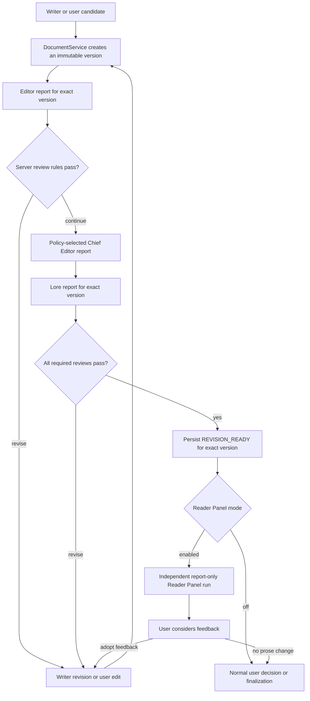

# GuraNovel architecture

This document describes the public architecture contract for GuraNovel. It separates what is
available in the v0.8 release from the chapter-quality pipeline planned for v0.9 and the optional
Reader Panel planned for v0.10. A name in a target-state diagram is not evidence that the
corresponding production code already exists.

## Capability legend

| Label | Meaning |
| --- | --- |
| **Implemented (v0.8)** | Present in the released application and backed by production code. |
| **Target contract (v0.9)** | Required architecture for the next chapter-production implementation; not implemented by this document. |
| **Future extension (v0.10)** | Reader Panel behavior that must preserve the v0.9 boundary; not implemented by this document. |

This document is an architecture contract only. It does not add workflow states, database schema,
routes, UI, or model calls.

## Implemented baseline (v0.8)

The following is the current implementation, not the larger historical workflow design:

- `Document` has an immutable sequence of `DocumentVersion` rows and a pointer to its current
  version. `DocumentService` is the application boundary for creating, writing, and restoring
  documents. It locks writes and checks `expected_current_version_id` so a newer version cannot be
  overwritten silently.
- A chapter-production run calls one configured generation provider, validates its response, and
  stores an outline and a draft through `DocumentService`.
- The run then creates one user action with `approved` and `rejected` options. Approval completes
  the run and changes the chapter status to `OUTLINE_APPROVED`; rejection ends the run as rejected.
- Chapter-production events expose a small allowlisted payload. Generated prose and prompts are not
  returned in event payloads.
- `WorkflowRun`, `WorkflowEvent`, `WorkflowCheckpoint`, `ActionRequest`, `ReviewReport`, and
  `DocumentVersion` provide reusable persistence primitives. The current chapter-production flow
  does not create checkpoints or chapter review reports.
- Existing project-creation and project-maintenance workflows use their own states, services,
  actions, reviewers, and persistence rules. Their Lore and Chief Editor capabilities are not
  connected to chapter production merely because similarly named agent contracts exist.
- `ProjectCreationGraph` and `ProjectMaintenanceGraph` are product-architecture names in this
  document. The v0.8 implementations are service-backed state machines; the repository does not
  currently run those workflows through a LangGraph runtime.
- Some chapter review names already appear in shared enums. Those names are schema affordances,
  not implemented chapter workflow nodes.

In particular, v0.8 does **not** implement Writer revision loops, chapter Editor/Lore/Chief Editor
review, `REVISION_READY`, Reader or Moderator agents, or a Reader Panel.

## Authority principles

The target pipeline is human-led and version-bound:

1. Model output is untrusted data. Providers return candidates or reports; they never return
   authoritative workflow commands.
2. Every review and audience report targets one immutable document version, never “the latest
   chapter” by implication.
3. Only application services persist state. Agent and provider objects have no database, workspace,
   action-resolution, or workflow-transition capability.
4. A user decision can accept a proposal, but canonical prose changes still pass through
   `DocumentService` and create a new `DocumentVersion`.
5. Reader feedback is advisory. It cannot replace required Editor, Lore, or Chief Editor review.
6. Persist identifiers, hashes, decisions, and bounded structured results. Do not put chapter text,
   full prompts, credentials, provider responses, or complete reports in workflow events or
   checkpoints.

## Reader-aware chapter quality pipeline

### Four responsibility lanes

The v0.9/v0.10 architecture separates four lanes that communicate through validated, persisted
artifacts:

| Lane | Responsibility | Output | Must not do |
| --- | --- | --- | --- |
| Generation and revision | Writer and Revision agents propose chapter text against a declared base version and bounded context. | Candidate text plus provenance, returned to the orchestrator. | Write a document, approve text, resolve an action, or transition a workflow. |
| Deterministic review | The review service validates exact-version inputs and structured Editor, Lore, and policy-selected Chief Editor reports, then applies server-owned pass/revise rules. | Version-bound `ReviewReport` references and a deterministic pass/revise result. | Treat free-form model text as a transition, create prose versions, or bypass a required reviewer. |
| Simulated reader feedback | Optional Reader agents report reactions; a Moderator identifies topics and organizes discussion without voting. | Version-bound reader, discussion, and aggregate reports. | Edit prose, approve findings, resolve chapter actions, or transition chapter workflow state. |
| Editorial and user decision | Editor reports frame editorial choices; the user selects whether and how a proposed change is adopted. The orchestrator validates that decision. | A resolved user action and, when adopted, a new canonical version followed by re-review. | Mutate an existing immutable version or treat feedback as self-executing. |

“Deterministic review” describes server-owned validation and transition rules. An Editor, Lore, or
Chief Editor provider may help produce a report, but that output is schema-validated and remains
advisory until the review service evaluates it.

### Target flow

Chief Editor review is policy-selected: the server configuration determines when it is required.
Lore review is required before the ready boundary. Neither Reader Panel results nor a user preference
can be substituted for a required report. Later implementation issues may refine individual review
policies without moving the persisted ready boundary.

## Actor and component permissions

“Approve” below means authorize adoption or resolve a user-facing action. “Transition” means persist
a workflow state change.

| Actor or component | Propose prose | Emit a report | Approve or resolve | Create canonical version | Transition workflow |
| --- | --- | --- | --- | --- | --- |
| Writer / Revision agent | Yes, as an unpersisted candidate | No | No | No | No |
| Editor agent | No; it may suggest bounded edits in its report | Yes, for one target version | No | No | No |
| Lore agent | No | Yes, for one target version | No | No | No |
| Chief Editor agent | No | Yes, for one target version when policy requires it | No | No | No |
| Deterministic reviewer service | No | Persists validated reviewer results | No | No | Computes pass/revise; the chapter orchestrator persists the transition |
| Reader agent | No | Yes, for one target version | No | No | No |
| Moderator agent | No | Yes, topic/discussion summaries only; it does not vote | No | No | No |
| User | Yes, through an explicit edit or revision request | May add user rationale, not an agent report | Yes, for pending actions they are authorized to resolve | Requests a write; does not bypass the service | Supplies a decision; does not write state directly |
| Chapter-production orchestrator | No | Persists only schema-valid outputs | Validates and records authorized decisions; cannot invent one | Calls `DocumentService` | Yes, by deterministic rules |
| Reader Panel orchestrator | No | Persists version-bound panel results | No chapter approval | No | Its own run only; never the chapter run |
| `DocumentService` | No | No | No | **Yes, exclusively** | No |
| HTTP route | No | No | No | No | No; it is a thin authenticated adapter |

Consequences of this matrix:

- No agent can write files or database rows directly, approve its own output, resolve an action, or
  set a workflow status.
- The user is the only external decision authority. The chapter orchestrator records a decision only
  after checking authorization, action scope, current state, and expected version.
- The server selects providers, models, report policies, and allowed transitions. A request cannot
  supply trusted status, report ownership, model identity, or provider configuration.
- Reader and Moderator findings can only become prose through a new user-authorized candidate
  version and the complete review loop.

## The single Reader Panel integration hook

### `REVISION_READY` (target contract, v0.9)

`REVISION_READY` is the one and only hook a Reader Panel may consume. It belongs to the
chapter-production workflow, not to the panel. The chapter-production orchestrator persists it only
after the current candidate has passed every required review/revision step.

Readiness has one authoritative discriminator. `WorkflowRun.status`, `WorkflowRun.current_node`, and
the authoritative `WorkflowCheckpoint.node_name` must all equal the same server-owned
`REVISION_READY` constant. The run must still be currently in that state; an older checkpoint or a
`revision_ready` event does not make a run ready after it has moved elsewhere.

The ready record is an exact-version capability, not a loose chapter status. Its checkpoint state
must contain only bounded mechanical data:

| Field | Contract |
| --- | --- |
| `chapter_workflow_run_id` | The chapter-production run that owns readiness; it must equal the checkpoint's `workflow_run_id`. |
| `chapter_id` | The chapter owned by the run. |
| `document_id` | The canonical chapter document. |
| `document_version_id` | The immutable version that passed review. |
| `content_hash` | The stored hash of that same `DocumentVersion`. |
| `editor_report_id` | Required `ReviewReport` targeting the same document and version. |
| `lore_report_id` | Required `ReviewReport` targeting the same document and version. |
| `chief_editor_report_id` | Required when the server-selected policy invoked Chief Editor; otherwise absent. |
| `review_policy_version` | Server-owned identifier for the rule set that produced readiness. |

All identifiers must be reloaded and scope-checked against the run's project and chapter before the
state is persisted or consumed. Every referenced report must belong to the same workflow run, target
the same document and version, use the expected review mode and role, and satisfy the active policy.
The stored hash must equal the hash on the referenced version.

The canonical readiness semantic key is **exactly**
`(chapter_workflow_run_id, document_version_id, review_policy_version)`. It cannot be extended with
another field to turn a conflict into a different key. `document_id`, content hash, required report
IDs, report roles/modes, and project/chapter/run scope are validation attributes that must match
completely under that same key. The checkpoint row ID and `checkpoint_index` are not readiness
identities: the current schema's unique
`(workflow_run_id, checkpoint_index)` pair provides ordering only and does not prevent two semantic
ready records for the same key.

Persistence ownership is explicit:

| State or artifact | Owning component | Persistence boundary |
| --- | --- | --- |
| Candidate or user-authored prose | Chapter-production orchestrator calling `DocumentService` | A new immutable `DocumentVersion`; never an in-place edit. |
| Editor, Lore, and Chief Editor result | Deterministic reviewer service | A `ReviewReport` scoped to project, chapter, workflow run, target document, and target version. |
| Current chapter-production state | Chapter-production orchestrator | `WorkflowRun`; `awaiting_user` is true only when a live user action exists. |
| Resumable exact-version state | Chapter-production orchestrator | `WorkflowCheckpoint.state_json`, with monotonic checkpoint index and the bounded fields above. |
| Audit marker | Chapter-production orchestrator | One `revision_ready` `WorkflowEvent` whose `workflow_run_id` and bounded payload bind it to the authoritative checkpoint, exact semantic key, safe validation IDs, policy version, and content hash. |
| User decision | Chapter-production orchestrator | A scoped `ActionRequest` plus a bounded decision event. |

The chapter-production orchestrator locks both the chapter run and canonical `Document` in one
transaction before an atomic create-or-reuse operation for the canonical readiness key. It verifies
`Document.current_version_id == document_version_id` in that transaction.

That same locked transaction applies a joint cardinality and corruption policy to authoritative
`REVISION_READY` checkpoint candidates and `revision_ready` audit events for the requested exact
semantic key `(chapter_workflow_run_id, document_version_id, review_policy_version)`:

Cardinality is counted strictly within that exact key. A well-formed, fully bound historical `1 + 1`
checkpoint/event pair for a different exact key is valid immutable history and is not counted as a
duplicate or conflict for the requested key. The same chapter workflow run may therefore complete
review for a newer document version or policy and persist a new exact-key readiness pair; a new
chapter workflow run per version is not required.

This historical isolation cannot be used to hide corruption. A checkpoint or event that purports to
belong to the requested exact key but has a malformed key, missing binding, duplicate, or mismatched
attribute is corruption for the requested key. A record that is identified by the current
authoritative checkpoint/event binding as part of the current ready transition is also corruption if
its key is missing or cannot be canonically decoded; it cannot be ignored as unrelated history.

| Ready checkpoint + audit event cardinality | Required result |
| --- | --- |
| `0 + 0` | Create exactly one authoritative checkpoint and exactly one bound audit event atomically. |
| `1 + 1` | Reuse both only when the exact semantic key, every validation attribute, event payload, and event-to-checkpoint/run binding match completely. |
| Any other combination or any mismatch | Fail closed and require reconciliation; never fill a gap or select an arbitrary record. |

The failure case includes a `0 + orphan event`, `1 + 0`, `1 + more-than-1 events`, a mismatched
`1 + 1`, and more-than-1 checkpoints with any event count. It fails before creating any new
checkpoint or event and before any downstream, Reader Panel, provider construction/call, token, or
other side effect. A malformed or conflicting event that claims the requested exact key or the
current transition binding is corruption, not a missing event that may be replaced. Locking prevents
new concurrent duplicates but does not conceal an existing duplicate, partial failure, or corrupt
record.

The audit event is identity-bound evidence that the atomic transition was recorded; it is not an
independent readiness authority. Its identity or payload alone can never be used to infer readiness,
and an event that is not bound to the single authoritative checkpoint and current run is rejected.
A future schema may enforce the semantic key and bindings with additional unique constraints, but
service-level locking, cardinality checks, and validation remain required.

A consumer accepts only the authoritative ready checkpoint for the run's **current**
`REVISION_READY` status and node. In its consumption transaction it locks the run and canonical
`Document`, then verifies `Document.current_version_id == document_version_id` and all validation
attributes under the exact key. It rejects an old/stale-version checkpoint, a run in another state,
missing or mismatched discriminators, and duplicate or conflicting ready records. It must not infer
readiness from an event alone, from a chapter status alone, from an arbitrary checkpoint row, or from
the presence of reports.

No other post-review event, UI flag, report, or transient graph node is a valid Reader Panel entry
point. This rule prevents duplicate panels, partially reviewed inputs, and “latest version” races.

### Normal path and optional panel path

After `REVISION_READY`, normal user decision/finalization remains available whether a panel exists or
not. Reader Panel mode is server-owned configuration evaluated for that transition:

- `mode=off`: return to the normal chapter path before creating a panel run. There is no Reader
  Panel `WorkflowRun`, checkpoint, event, action, report, conversation/message, provider construction,
  provider call, token use, or other persistence side effect. The ready transition itself remains a
  chapter-production fact; turning the optional panel off does not undo it. This mode check is the
  first Panel branch and returns before Panel create-or-reuse, cardinality queries that could lock or
  mutate Panel state, or any provider setup.
- Enabled mode: create a separate Reader Panel run idempotently keyed by exactly
  `(chapter_workflow_run_id, document_version_id, review_policy_version)`, never by an arbitrary
  checkpoint row ID or an extended identity.
  Panel state and reports remain owned by that run and must not mutate the chapter-production run.

The panel run must not claim or overwrite `Project.current_workflow_id`. It is independently
resumable and may execute without blocking project creation, project maintenance, or the normal
chapter finalization path. Panel create-or-reuse runs in an atomic consumption transaction that locks
the chapter run and canonical `Document`, revalidates the exact three-part key and all validation
attributes, and requires `Document.current_version_id == document_version_id`; chapter ID,
checkpoint row ID, or document version alone is insufficient. Normal finalization performs the same
locked, atomic current-version and readiness checks before it consumes the ready state. Either path
rejects an old or stale ready record.

Within that locked transaction, Panel create-or-reuse applies an exact cardinality and corruption
policy to `WorkflowRun` records for the three-part semantic key:

| Matching Panel runs | Required result |
| --- | --- |
| `0` | Create exactly one Panel `WorkflowRun` with the validated exact input and initial status binding. |
| `1` | Reuse it only when every validation attribute, exact input reference, workflow type, and allowed status binding matches completely. |
| More than `1`, or any mismatch | Fail closed and require reconciliation; never select an arbitrary record. |

The more-than-one and mismatch cases fail before any new Panel persistence, event, action, report,
conversation/message, provider construction, provider call, or token side effect. Locking prevents a
new concurrent duplicate, but it must not hide or repair an existing duplicate, a partial prior
failure, or corrupt data. Those conditions remain explicit reconciliation failures.

The panel produces reports only. Its orchestrator may advance its own internal state according to
server rules; Reader and Moderator agents themselves cannot transition even that state. Completion,
failure, or absence of the panel never certifies editorial quality and never changes canonical text.

Future panel persistence has the same explicit ownership rule:

| Panel state or artifact | Owning component | Persistence boundary |
| --- | --- | --- |
| Launch and exact input | Reader Panel orchestrator | A separate `WorkflowRun` idempotently bound to exactly `(chapter_workflow_run_id, document_version_id, review_policy_version)` after revalidating its document, hash, reports, and current-version attributes. |
| Resumable panel state | Reader Panel orchestrator | Its own bounded `WorkflowCheckpoint`; never the chapter checkpoint. |
| Reader and Moderator output | Reader Panel orchestrator after strict validation | Version-bound Reader Panel report records defined by the v0.10 schema; workflow state and events hold references, not report bodies. |
| Panel audit events | Reader Panel orchestrator | Allowlisted `WorkflowEvent` payloads containing safe IDs and mechanical state only. |
| Feedback adoption decision | Chapter-production orchestrator | A chapter-scoped `ActionRequest`; the panel cannot resolve it. |

## New versions, re-review, and stale results

An immutable version keeps its reports forever, but readiness is current only for the version that
earned it.

1. A Writer revision, a user-authored edit, a restore, or adoption of Reader Panel feedback calls
   `DocumentService` with the expected current version and creates a new `DocumentVersion`.
2. The chapter-production orchestrator leaves the old version, reports, checkpoint, events, and
   panel results intact as audit history, but the old ready tuple is no longer eligible for current
   finalization or a new panel launch.
3. The new version enters the review pipeline at Editor review. It needs new version-bound Editor,
   policy-selected Chief Editor, and Lore results before a new `REVISION_READY` transition.
4. Existing reports are never copied forward or treated as approval of the new text, even when the
   edit is small or the content hashes happen to be compared elsewhere.

A result is **stale for the current chapter** when its `document_version_id` differs from the
document's current version (or when its recorded hash fails validation). Stale is a derived
version-relevance property, not deletion, cancellation, or retroactive failure. Historical reports
remain readable and truthful about the immutable version they evaluated. UI and API consumers must
show their target version and stale status and must never present stale findings as current approval.

An in-flight panel may finish against its immutable target, but its output is stale if a newer
canonical version has become current. Accepting any suggestion creates yet another version and
restarts required review; it cannot patch the ready version in place. The locked current-version
check gates creation or reuse of a panel run; it does not cancel a panel that already started against
an immutable snapshot before the edit.

## Persistence and security boundaries

The v0.9/v0.10 implementations must apply these boundaries; their presence here does not imply that
the v0.8 chapter-approval endpoints already implement the future authorization model:

- Validate UUIDs, project/chapter/run ownership, document/version parentage, reviewer role, review
  mode, action status, and current version on every mutation. Do not trust relationships supplied by
  the client or provider.
- Use row/advisory locking and expected-version checks at service boundaries. Concurrent edits fail
  closed rather than silently moving a report or decision to newer prose.
- Keep provider and prompt details in server-selected composition. Store only allowlisted
  provenance needed for audit; never expose secrets, endpoints, raw provider payloads, or hidden
  instructions.
- Events and checkpoints are resumability/audit records, not document stores. Public API projections
  use explicit allowlists and exclude prose and full report bodies.
- Validate structured model output with strict schemas and bounds before persistence. Invalid,
  incomplete, oversized, or cross-scoped output cannot advance state.
- A persistence failure after a document commit is an explicit reconciliation case. The workflow
  must not delete or overwrite a committed version to manufacture apparent atomicity.
- Only an authenticated, authorized user may resolve a pending action, and a resolution is accepted
  once. Default options are display guidance, never automatic authorization.

## Compatibility contract

This design is additive and does not reinterpret completed v0.7/v0.8 data.

- Existing project-creation and project-maintenance service/state-machine states, transitions,
  checkpoints, actions, reports, and API contracts remain unchanged. Chapter-quality and Reader
  Panel code must not import their private state or reuse their actions as shortcuts.
- Existing chapter-production start/get/resolve behavior and historical runs remain readable under
  their current contract. New v0.9 states and endpoints, when implemented, must be introduced
  additively or behind an explicit version/capability boundary rather than changing the meaning of a
  v0.8 approval.
- Existing document read, write, version-list, version-content, and restore semantics remain
  canonical. New workflows call the same `DocumentService` boundary and honor
  `expected_current_version_id`.
- Reader Panel uses a distinct workflow type and persistence lifecycle. It does not occupy the
  project's exclusive workflow pointer and cannot block or transition project creation or project
  maintenance.
- Old runs that have no `REVISION_READY` checkpoint cannot be treated as panel-ready merely because
  they completed successfully. Migration or explicit re-review would be a separate implementation
  decision.

## Delivery boundaries

The rollout is intentionally staged:

| Release | Responsibility |
| --- | --- |
| v0.8 (implemented) | Document/version foundation; existing project creation, chapter approval gate, and project maintenance. |
| v0.9 (target) | Chapter Writer/revision loop, exact-version Editor/Chief Editor/Lore review, user decisions, persistence, APIs/UI, and the durable `REVISION_READY` boundary. |
| v0.10 (future) | Optional Reader/Moderator panel state, reports, discussion, stale handling, independent API/UI, and recovery, consuming only `REVISION_READY`. |

Implementation work must preserve the authority and persistence rules above even if internal node
names change. Moving the Reader Panel before required review, adding a second readiness signal, or
allowing a report-producing actor to write or approve prose is an architecture change and requires
explicit review.
